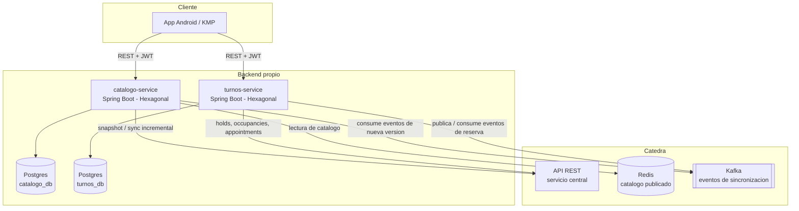

# Diagrama de arquitectura general

## Qué representa cada parte

- **App KMP**: único punto de entrada para el usuario final. Habla con los dos servicios propios, nunca directo con la cátedra.
- **catalogo-service**: dueño del catálogo local (categorías, profesionales, horarios). Se mantiene sincronizado con la cátedra vía snapshot inicial + eventos Kafka, usando Redis como fuente de lectura del catálogo publicado.
- **turnos-service**: dueño del proceso de reserva (holds, confirmaciones). Orquesta el flujo REST + Kafka contra la cátedra para construir disponibilidad y confirmar turnos.
- **Catedra**: todo lo que no administramos nosotros — es la fuente de verdad externa con la que se sincronizan ambos servicios.

