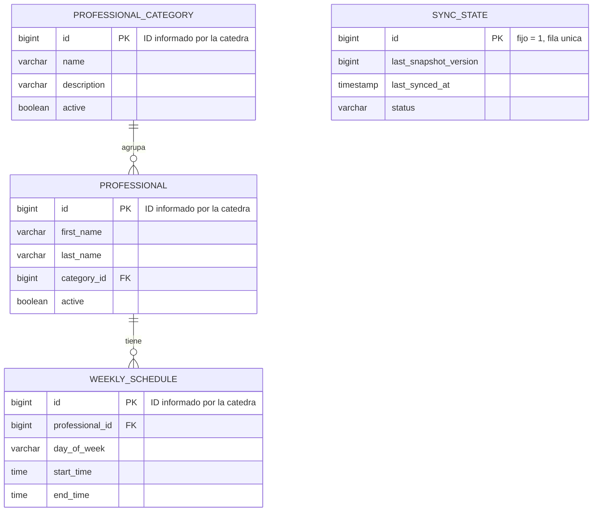

# Modelo de datos — Catálogo (v1)

## Decisiones de diseño

- **Los IDs no se autogeneran**: `professional_category.id`, `professional.id` y `weekly_schedule.id` son los mismos identificadores que informa el servicio central de la cátedra. Esto es necesario para que el snapshot y la sincronización incremental puedan hacer upsert sin reconciliar IDs entre sistemas.
- **`sync_state` es una tabla de una sola fila** (id fijo = 1): guarda el estado de la última sincronización exitosa (versión del snapshot, fecha, y si está al día, sincronizando o en error). Se consulta antes de decidir si hace falta un snapshot completo o alcanza con los eventos incrementales.
- **`weekly_schedule` es un horario recurrente**, no una instancia de turno concreta — representa la disponibilidad general del profesional (ej: "lunes de 9 a 13"), no una reserva puntual. Las reservas van a vivir en `turnos-service`, no acá.
